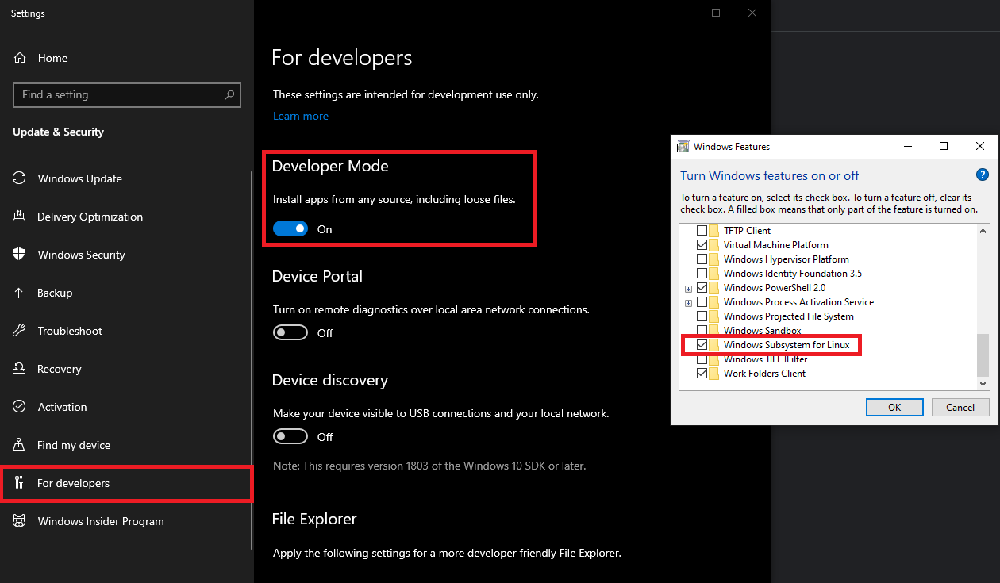
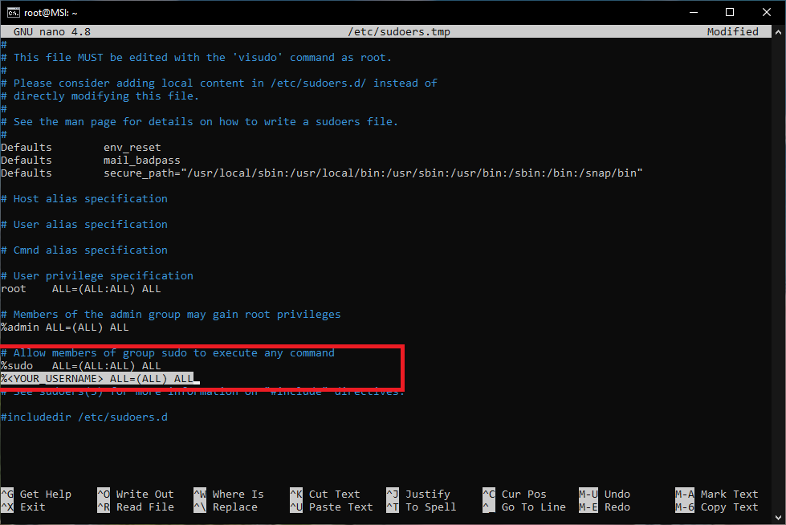

# Deploy a virtual printer to Windows

This solution heavily depends on the Windows Subsystem for Linux (WSL).  Make sure your Windows machine supports WSL before proceeding.

## About

This is a setup tutorial for deploying and using an IPP printer on a Windows device using the [IPP Sample Software](https://github.com/istopwg/ippsample).  This allows me to simulate adding printers to end user devices using [Aisera's](https://aisera.com/) RPA tool.

## Installing WSL

1.  The easiest way to install WSL is to simply open command line and execute the command `wsl --install`.

Alternatively, you can Navigate to Windows Settings -> For Developers -> [Toggle On] Developer Mode.  Then open Add or Remove Programs and check **Windows Subsystem for Linux**.

Once you've turned on WSL, you'll need to reboot your machine to complete setup.

2.	After restarting your machine a command prompt should auto-start and you can follow the prompts to create your username and password for WSL.

Once your credentials have been created, you can start WSL anytime by typing `wsl` into command line or powershell.

### Configure User Admin [Optional]

If you want to automate the IPP startup process, you'll need to make sure your WSL user account has adequate permissions to run bash scripts automatically without requiring credentials.

In order to do so I just gave my WSL user full root permissions.  If you want to follow a lesser privilege approach, you can find online tutorials for modifying the sudoers file using `visudo`.

1.  Inside WSL, type `sudo -i` to access the root user.

2.  (*Optional*) you may want to create a backup of your sudoers file.  To do so, simply type and execute `cp /etc/sudoers /root/sudoers.bak`

3.  Type `visudo` to access the sudoers file editor.

4.  Navigate to the section titled, "Allow memebers of a group sudo to execute any command" and type `%your_username ALL=(ALL) ALL`

5.  Press `ctrl + x` then `y` to save and exit the file.

## Install and Configure IPP